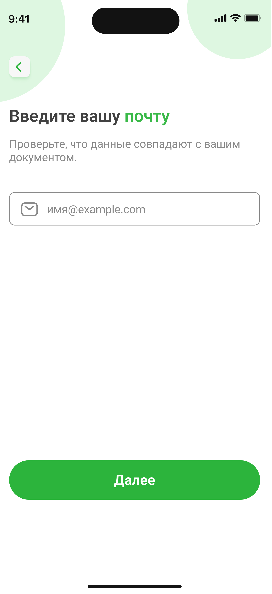
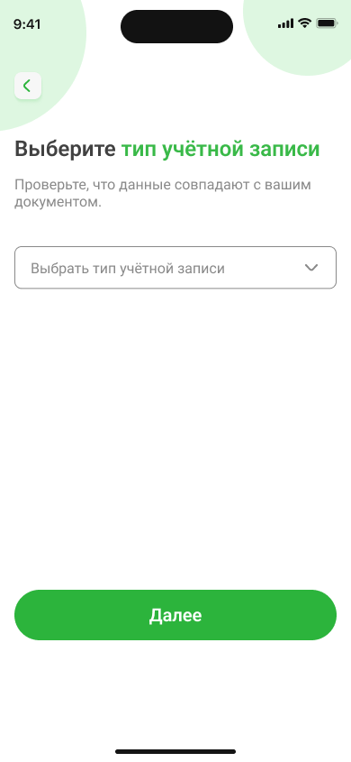
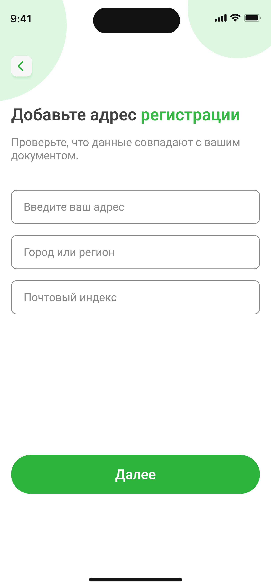
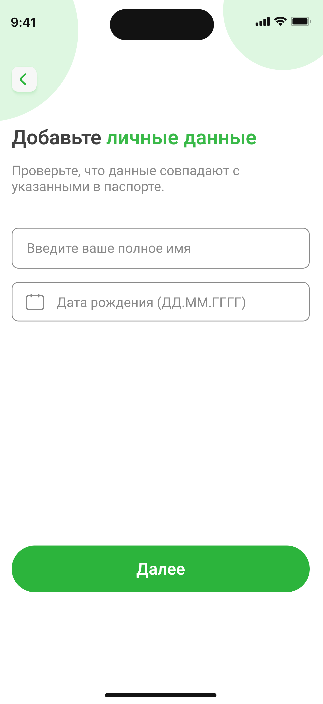
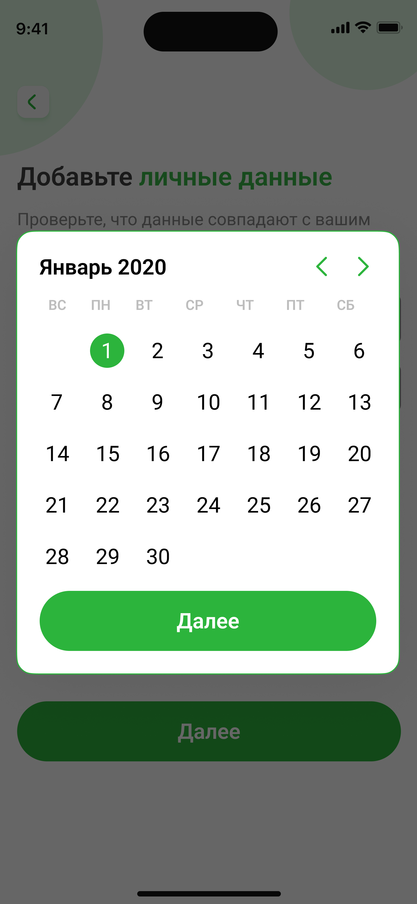

# Руководство пользователя

## Добро пожаловать в мобильное приложение NovaBank! В этом руководстве вы найдете инструкции по установке приложения, регистрации, основным функциям и полезные советы.

### Установка приложения

1. Перейдите на официальный сайт **NovaBank**: https://novabank.com.

2. Скачайте приложение из **App Store** или **Google Play**.

3. Установите приложение на ваше устройство.

> [!TIP] 
> Совет: Убедитесь, что у вас достаточно свободной памяти на устройстве перед установкой.

### Основные функции приложения

**NovaBank** — это не просто банк, а ваш финансовый помощник. Вот что вы можете делать:

- **Баланс счета**
Всегда актуальный остаток, включая начисленные проценты и бонусы.

- **Мгновенные переводы**
Отправляйте деньги друзьям, родным или бизнесу — даже ночью!

- **История операций с фильтрами**
Ищете конкретный платёж? Отсортируйте по дате, сумме или категории.

- **Безопасные уведомления**
Получайте push-сообщения о каждой операции — никаких неожиданностей!

### Таблица функциональности:

|Функция|Описание|
|---------|-----------|
|**Баланс счета**|Показывает текущий остаток на вашем счете|
|**Переводы**|Позволяет отправлять деньги|
|**История операций**|Показывает все ваши транзакции|

### Изображение главного экрана

_На главном экране приложения отображается баланс, последние операции и быстрый доступ к переводам._

### Настройка учётной записи

> [!WARNING]
> **Внимание!** Убедитесь, что данные совпадают с указанными в паспорте!

1.Введите вашу почту:

2.Выберите тип учётной записи из списка:

3.Заполните данные вашего адреса регистрации:

4. Введите ваше полное имя, и выберите дату вашего рождения в меню:

